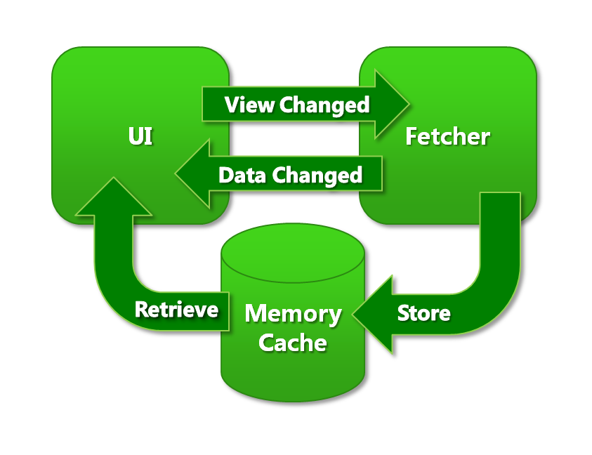

# Asynchronous Data Fetching

## Some background

In most mapping clients drawing a map means first gathering data from disk, database or web and after that a map is drawn. Because gathering data takes time the user has to wait for this process to complete. During this process sometimes a white map is shown and the user cannot interact with the map. 

This experience can be improved by drawing a buffer of the previous image during pan and zoom. But this results in white space along the edged. This can again be countered by other optimizations but there are limits to what can be done along this design path and it tends to lead to hacked up solutions.

In Mapsui we completely seperated drawing from fetching data. The renderer only renders the data it has available in memory at that instant. The fetcher runs on a background thread receives messages from the UI thread telling it what to fetch.

## The async data fetcher architecture

The diagram above shows how Mapsui's data fetcher works. The data fetcher runs on a background thread. The UI and Fetcher communicate through non blocking messages. Whenever the user pans or zooms a View Changed message is sent to the Fetcher. Whenever new data arrives a Data Changed message is sent to the UI so that it knows it should redraw the map. The fetcher dumps incoming data into a cache. The UI renderer retrieves whatever is needed from that cache when rendering.

Both the fetcher and the renderer can use all kinds of smart tricks. In case of tiling the fetcher can pre‐fetch tiles based on its current view, or on the way the view changes over time. The renderer could search for alternative tiles (higher or lower levels) when the optimal tiles are not available. Those strategies should be tuned to support each other. For instance, in the current implementation the renderer uses higher level tiles when the optimal tiles are not available, and the fetcher pre‐fetches higher level tiles to assist the renderer. But the way they play together is not specified in the interface. This loose coupling keeps things simple and flexible and the renderer never has to wait for the fetcher which results in a smooth (perceived) performance.