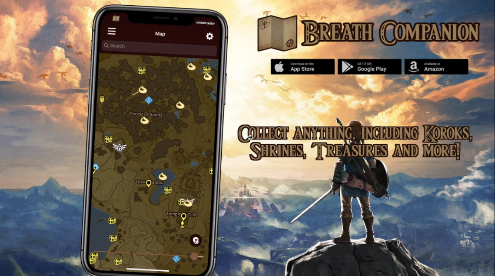
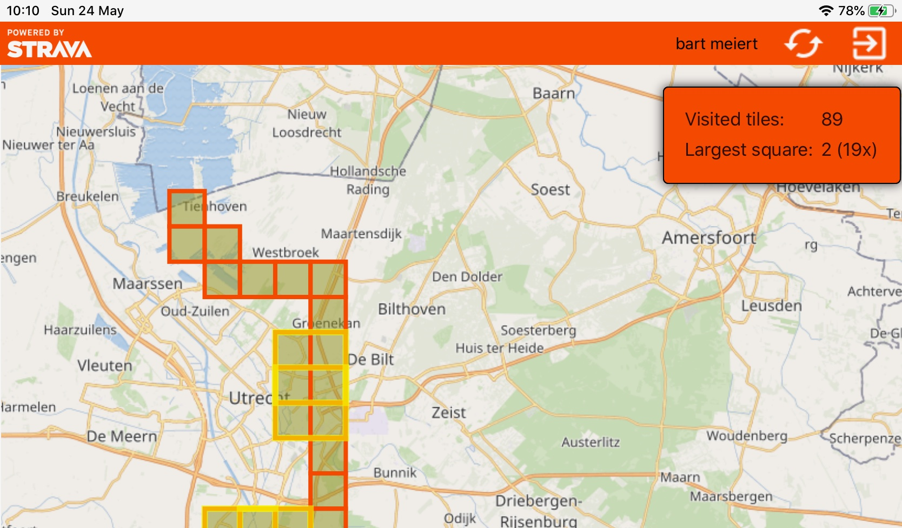

# **Mapsui** documentation.

This is the documentation of the Mapsui open source map component.
- [General documentation](http://mapsui.com/documentation/home.html)
- [API documentation](http://mapsui.com/api/index.html)
- [Mapsui on GitHub](https://github.com/mapsui/mapsui)

## Projects that use Mapsui

### Breath Companion

### Squadra

@mapsui-users Please send info on other apps using Mapsui to add them here

## Support

If you are looking for paid support in the form of contract work or consoluting please mail [info.mapsui@gmail.com](mailto:info.mapsui@gmail.com).
