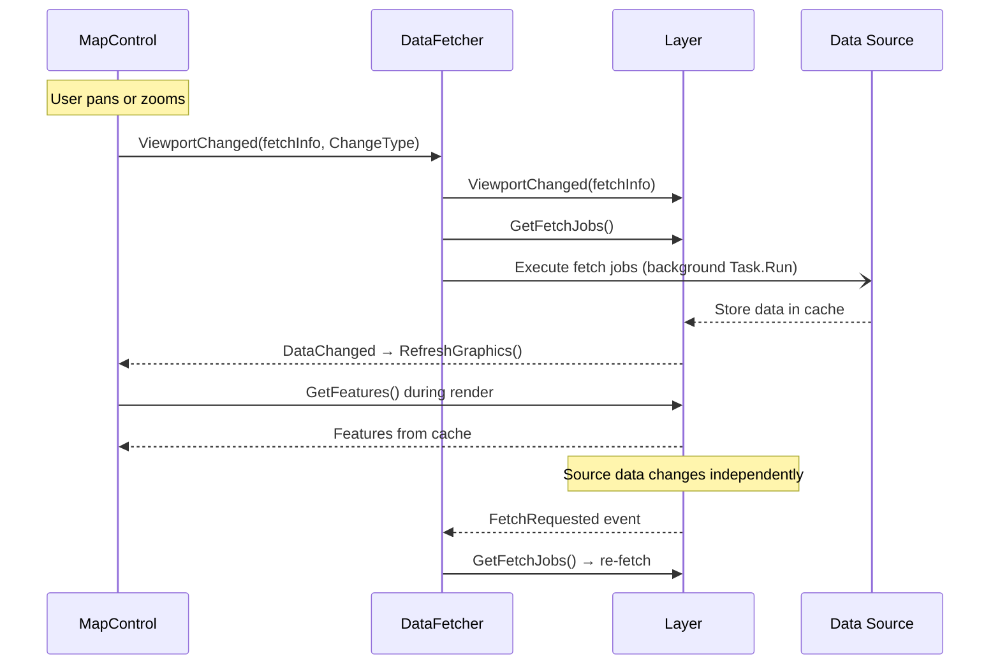
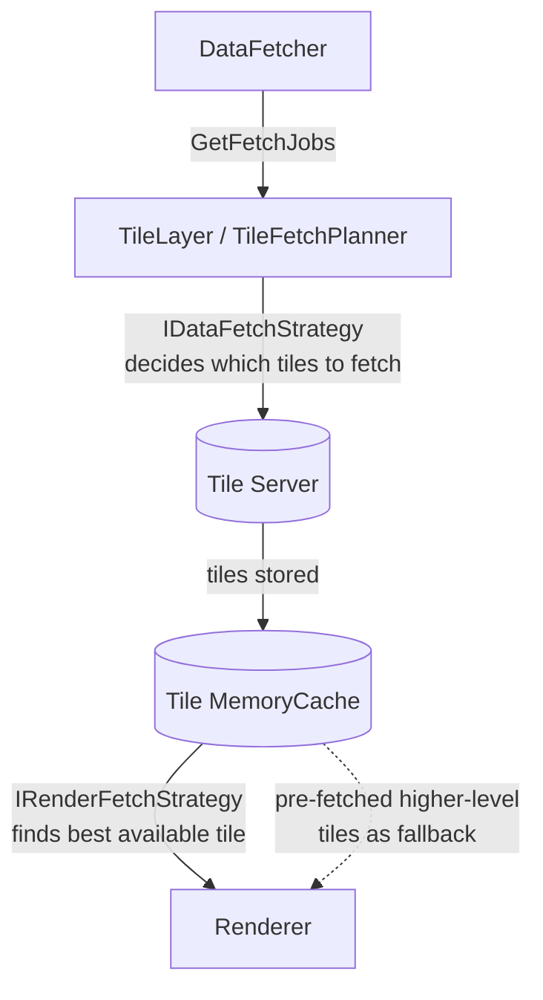

# Asynchronous Data Fetching

## Some background

To get smooth performance while panning and zooming data needs to be fetched on a background thread. Even if it is fetched on a background thread it will use resources which could be noticeable in the responsiveness of the map. The asynchronous data fetching of Mapsui tries to take this into account to optimize the user experience.

## ChangeType 

*(ChangeType was introduced in V3; in V2 the majorType boolean had this purpose)*

When calling the RefreshData method on the layers, we pass in a ChangeType parameter which could be:

- Continuous - During dragging, pinch zoom, or animations.
- Discrete - On zoom in/out button press, on touch up, or at the end of an animation.

The layers themselves decide how to respond to the refresh call. For different data types, different strategies are used.

## TileLayer data fetching
The diagram below shows how the TileLayer's data fetcher works. The data fetcher runs on a background thread. The UI and Fetcher communicate through non-blocking messages. Whenever the user pans or zooms, the UI sends a message to the fetcher.

### Read/Write cache
For rendering, the cache is only read. For data fetching, the cache is primarily written to, but it also needs to read the cache in order to know which data is already available and does not need to be fetched again.

### Strategies
Both the fetcher and the renderer can use several optimizations to improve the experience, for example:

- The fetcher can pre-fetch tiles that are not directly needed but could be in the future.
- The renderer can search for alternative tiles (higher or lower levels) when the optimal tiles are not available.

The implementation of these strategies can be overridden by the user by implementing interfaces that can be passed into the TileLayer constructor.

- The **IDataFetchStrategy** *(IFetchStrategy in V2)* determines which tiles are fetched from the data source to be stored in the cache. There is a DataFetchStrategy default implementation and a MinimalDataFetchStrategy implementation.
- The **IRenderFetchStrategy** *(IRenderGetStrategy in V2)* determines which tiles are fetched from the cache to use for rendering. There is a RenderFetchStrategy default implementation and a MinimalRenderFetchStrategy implementation.

These strategies should be tuned to work together. For instance, in the current implementation, the renderer uses higher level tiles when the optimal tiles are not available, and the fetcher pre-fetches tiles that are likely to be requested soon.

### TileLayer cache and strategy detail

The `TileLayer` adds a two-strategy pattern on top of this general flow: one strategy decides which tiles to fetch, the other decides which cached tiles to hand to the renderer.

## Data fetching in other layers
Other layers like the Layer and ImageLayer have their own implementation. They use a delay mechanism in fetching new data and ignore ChangeType.Continuous.
