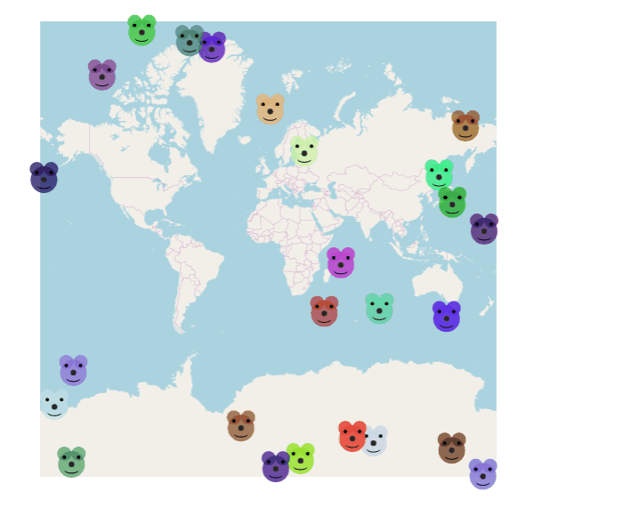

# Custom Style Renderers

## Summary

Mapsui supports *custom style renderers*. This means a user can create a *custom style* and associate it with a *custom style renderer* to allow full freedom in rendering a feature the way the user would like.

## How it works
- Create a custom style by deriving a class from IStyle. 
- Assign that style to an ILayer.Style or IFeature.Styles.
- Create a custom renderer by deriving a class from ISkiaStyleRenderer and implementing the Draw method.
- Register the association of the *custom style* to the *custom style renderer* as in the line below. The consequence will be that if the Mapsui renderer detects this style it will call the Draw method on the style renderer. 


This is how you register the association of a custom style to a custom style renderer
```csharp
MapRenderer.RegisterStyleRenderer(typeof(CustomStyle), new SkiaCustomStyleRenderer());
```

This is the ISkiaStyleRenderer interface that you need to implement:
```csharp
public interface ISkiaStyleRenderer : IStyleRenderer
{
  bool Draw(SKCanvas canvas, Viewport viewport, ILayer layer, IFeature feature, IStyle style, RenderService renderService, long iteration);
}
```

The IFeature has a Geometry field. The renderer is responsible to cast the IFeature.Geometry to the type it intends to render. The IStyle is the custom style the user defined. It can contain extra style information not present in the default style classes. The user will need to cast that IStyle to the custom style to use this extra information.

## Code sample
See the [CustomStyle sample](https://mapsui.com/v5/samples/#/Styles/CustomStyle) for a working example.



In this sample the custom style contains no extra information, it is just an indication to use the associated custom renderer. It would be possible to add extra fields like EarColor and NoseSize to the custom style which the renderer can use.

## Remarks
Note that the renderer depends on the technology we use for the rendering implementation which is SkiaSharp. Theoretically we could change this implementation or add other implementations but there are no plans for that.
