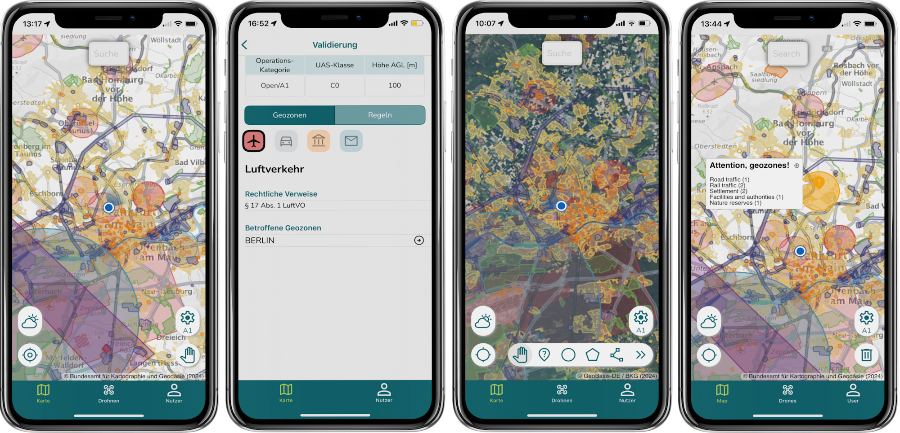

# Projects That Use Mapsui

Want to know which version of Mapsui these projects are using? Check out our guide on [Identifying Mapsui Versions in Projects](identifying-mapsui-versions.md).

### Breath Companion

### Droniq Maps

### LokqlDx - KQL data explorer

### Squadra

### Rutas Tarija

